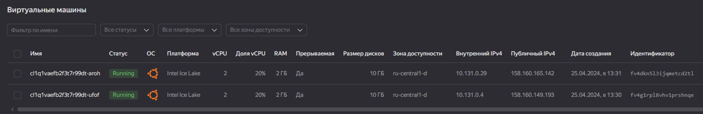
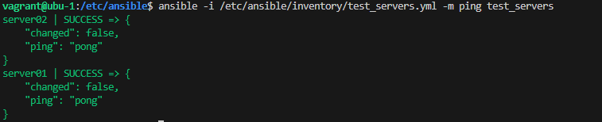

# Домашнее задание к занятию «Ansible. Часть 1» - `Семенов С.В.`

### Задание 1

Ответьте на вопрос в свободной форме.

Какие преимущества даёт подход IAC?

```
- идентичность систем на всех заданных серверах, ожидаемое поведение приложений в независимости от среды исполнения, экономия времени и человеческих ресурсов, простая и понятная концепция, относительно невысокий порог вхождения.
```
---

### Задание 2

Выполните действия и приложите скриншоты действий.

Установите Ansible.
Настройте управляемые виртуальные машины, не меньше двух.
Создайте файл inventory с созданными вами ВМ.
Проверьте доступность хостов с помощью модуля ping.



---

### Задание 3

Ответьте на вопрос в свободной форме. Какая разница между параметрами forks и serial?

`- forks относится к созданию параллельных потоков или процессов, которые работают независимо и параллельно друг другу, в то время как serial относится к последовательному выполнению задач или операций в одном потоке без параллельных вычислений.`

### Задание 4

В этом задании вы будете работать с Ad-hoc коммандами.Выполните действия и приложите скриншоты запуска команд.

Установите на управляемых хостах любой пакет, которого нет.
```
ansible all -m apt -a "name=mc state=latest" -b
```

Проверьте статус любого, присутствующего на управляемой машине, сервиса.
```
ansible server01 -m shell -a "systemctl status cron.service"
```
Создайте файл с содержимым «I like Linux» по пути /tmp/netology.txt.
```
ansible all -m shell -a "echo I like Linux>/tmp/netology.txt" -b
```