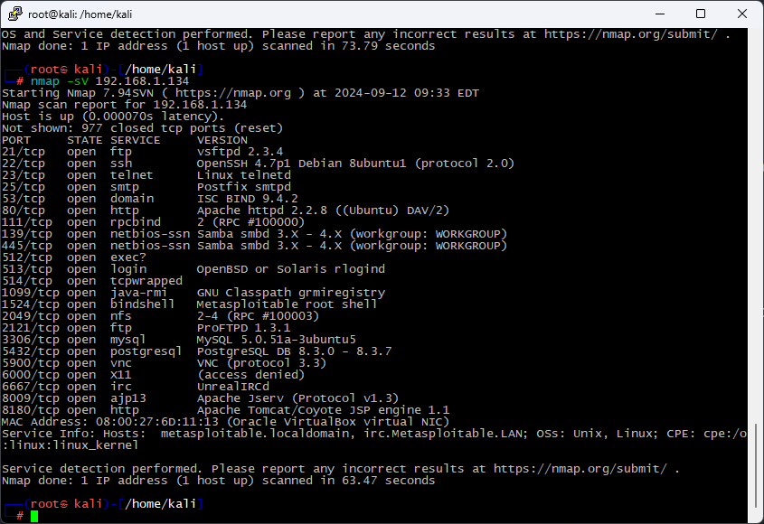
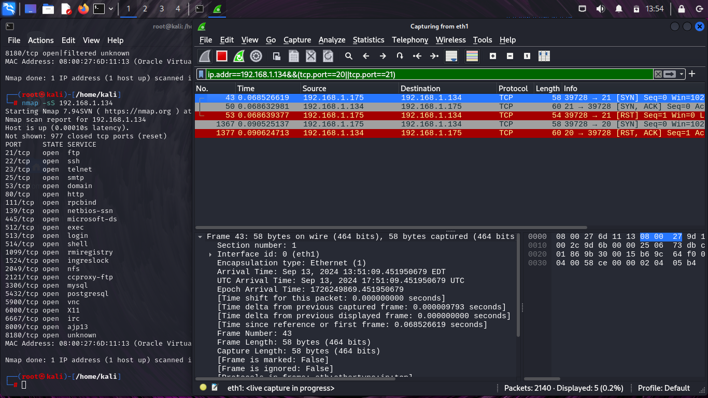
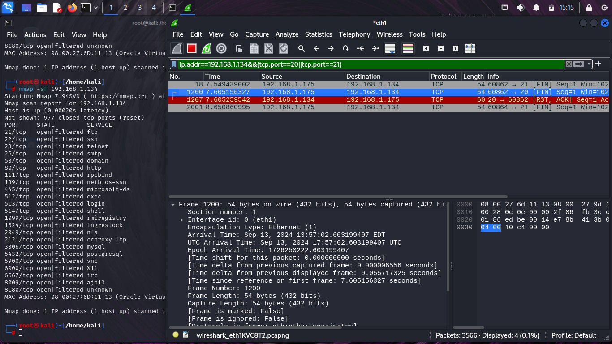
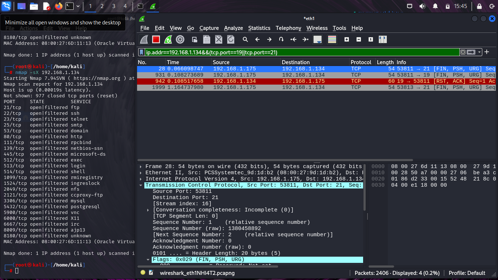
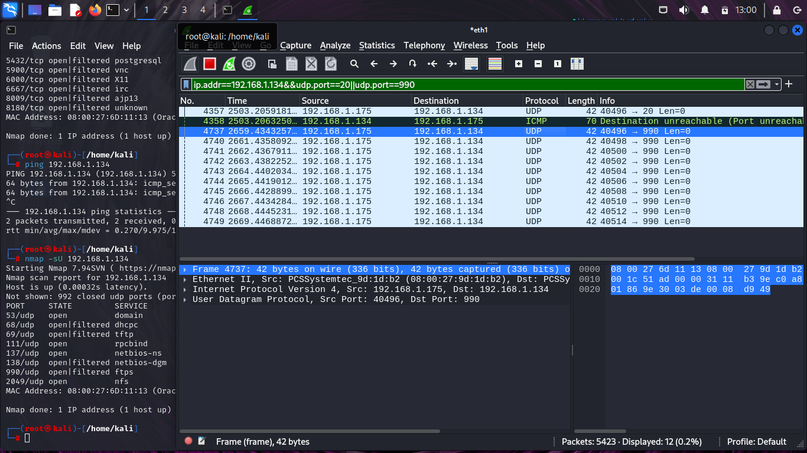

# Домашнее задание к занятию `«Уязвимости и атаки на информационные системы»` - `Васильев Николай`

---
## Задание 1

### Какие сетевые службы в ней разрешены?

|port/protocol|name|
|-----|-----|
|21,2121/tcp|ftp||
|22/tcp|ssh||
|23/tcp|telnet|
|25/tcp|smtp|
|53/tcp|domain|
|80,8180/tcp|http|
|111/tcp|rpcbind|
|139,445/tcp|netbios-ssn|
|512/tcp|exec?|
|513/tcp|login|
|514/tcp|tcpwrapped|
|1099/tcp|java-rmi|
|1524/tcp|bindshell|
|2049/tcp|nfs|
|3306/tcp|mysql|
|5432/tcp|postgresql|
|5900/tcp|vnc|
|6000/tcp|X11|
|6667/tcp|irc|
|8009/tcp|ajp13|

### Какие уязвимости были вами обнаружены? (список со ссылками: достаточно трёх уязвимостей)
* [ISC BIND 9.4.2](https://www.exploit-db.com/exploits/6122)
* [UnrealIRCd 3.2.8.1](https://www.exploit-db.com/exploits/16922)
* [vsftpd 2.3.4](https://www.exploit-db.com/exploits/17491)

___

## Задание 2

### Скан SYN

В этом режиме отправляется пакет с флагом SYN на порт. Порт не доступен, если сервер отвечает [RST, ACK]. Если порт доступен, сервер отвечает [SYN, ACK].

### Скан FIN

В режиме FIN отправляется пакет с соответствующим флагом. Сервер отвечает [RST, ACK] если порт будет не доступен. На открытый порт сервер ничего не отвечает, после nmap повторно отправляет на этот порт [FIN] пакет.

### Скан Xmas

Отправляется несколько флагов [FIN, PSH, URG]. Дальше схема похожа на режим FIN.

### Скан UDP

Медленный режим сканирования, по портам сервера рассылаются UDP пакеты. Если в ответ сервер приходит ICMP пакет, значит порт закрыт. Если ответа нет, значит порт открыт.