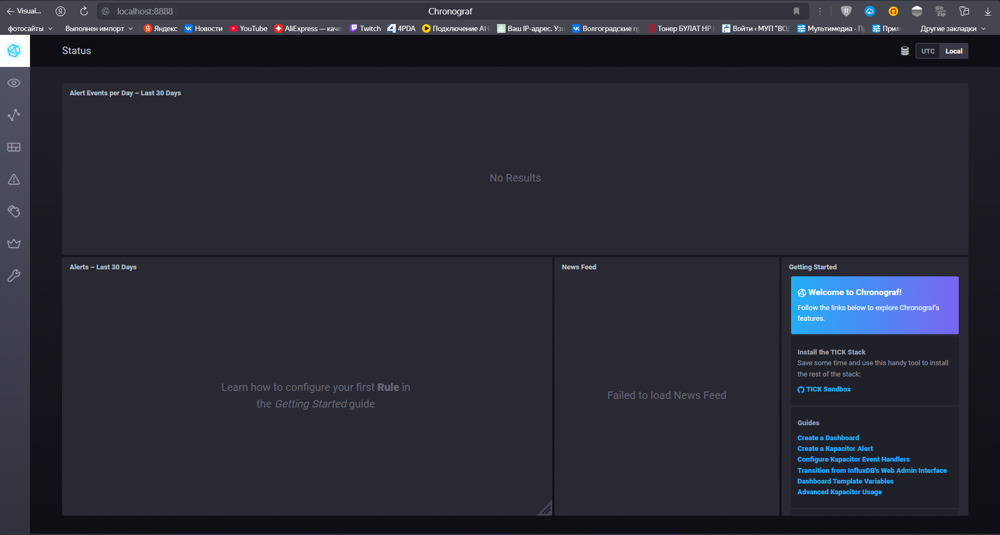
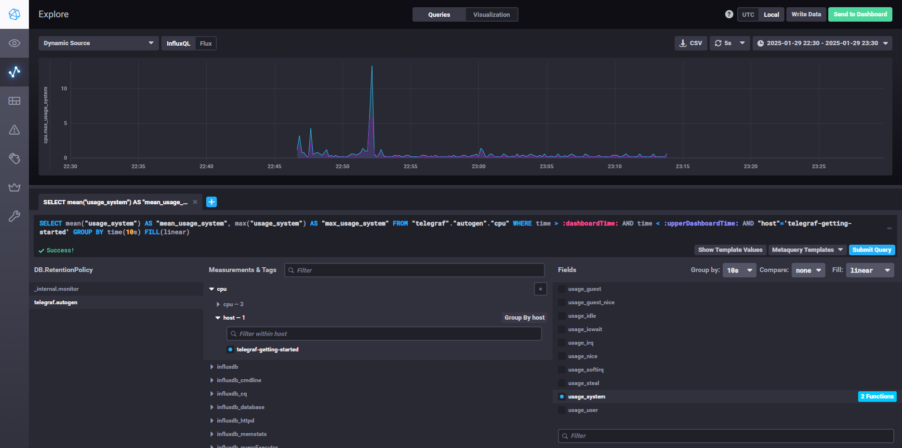
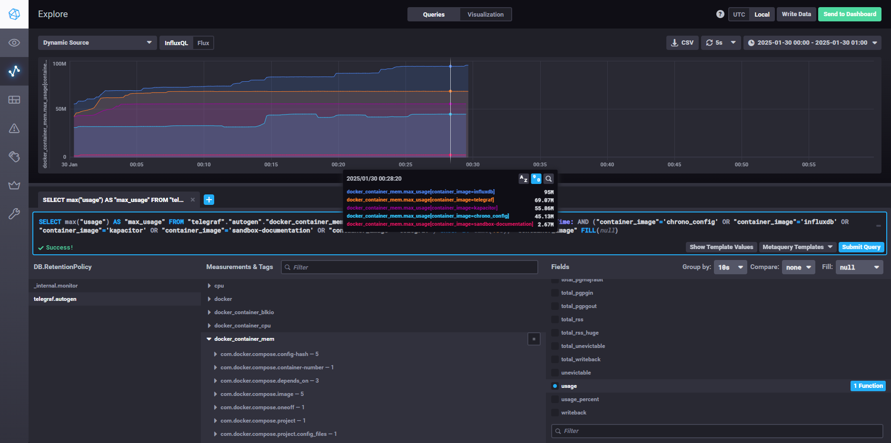

# Домашнее задание к занятию `«Системы мониторинга»` - `Васильев Николай`

## Обязательные задания

1. Вас пригласили настроить мониторинг на проект. На онбординге вам рассказали, что проект представляет из себя 
платформу для вычислений с выдачей текстовых отчетов, которые сохраняются на диск. Взаимодействие с платформой 
осуществляется по протоколу http. Также вам отметили, что вычисления загружают ЦПУ. Какой минимальный набор метрик вы
выведите в мониторинг и почему?
> Я думаю, что потребуются основные данные состояния системы, это:
>* CPU - нагрузка на процессор,
>* RAM/SWAP - процент использования ОЗУ,
>* DISK - скорость чтения/записи, inodes.
> 
> И состояние работы самой платформы:
>* Logs - информация состояний работ основных сервисов,
>* HTTP - соединения которые в настоящее время активны или бездействуют.
#
2. Менеджер продукта посмотрев на ваши метрики сказал, что ему непонятно что такое RAM/inodes/CPUla. Также он сказал, 
что хочет понимать, насколько мы выполняем свои обязанности перед клиентами и какое качество обслуживания. Что вы 
можете ему предложить?
>* RAM - используется для мониторинга использования оперативной памяти.
>* inodes - У каждого файла есть свой номер, если файлов много, то номеров может не хватить, сервер будет говорить что на диске нет места, хотя это не так.
>* CPUla - отображает среднюю нагрузку на процессор за определённый период времени.
>
> Можно предложить метрику SLA. Может содержать детальное описание предоставляемого сервиса, в том числе перечень параметров качества, методов и средств их контроля, времени отклика поставщика на запрос от потребителя.
#
3. Вашей DevOps команде в этом году не выделили финансирование на построение системы сбора логов. Разработчики в свою 
очередь хотят видеть все ошибки, которые выдают их приложения. Какое решение вы можете предпринять в этой ситуации, 
чтобы разработчики получали ошибки приложения?
> Развернуть какое-либо решение с открытым исходным кодом, например Sentry.
#
4. Вы, как опытный SRE, сделали мониторинг, куда вывели отображения выполнения SLA=99% по http кодам ответов. 
Вычисляете этот параметр по следующей формуле: summ_2xx_requests/summ_all_requests. Данный параметр не поднимается выше 
70%, но при этом в вашей системе нет кодов ответа 5xx и 4xx. Где у вас ошибка?
> Я думаю что в формуле не хватает 3xx HTTP-кодов перенаправлений, возможно и информационных 1xx. "(summ_2xx_requests+summ_3xx_requests)/summ_all_requests"
#
5. Опишите основные плюсы и минусы pull и push систем мониторинга.
> __Плюсы push-модели:__
>
>- Данные проще реплицировать в разные системы мониторинга или их копии.
>- Можно гибко настроить отправку пакетов данных с метриками (на каждом клиенте можно задать объём данных и частоту отправки).
>- UDP — более экономичный способ передачи данных, что может повысить производительность сбора метрик
>
> __Минусы push-модели:__
> 
>- Нет гарантии, что будут опрашиваться только те агенты, которые настроены в системе мониторинга
>- Нельзя настроить безопасное взаимодействие агентов с сервером через единый прокси
>- Сложно собирать логи с агентов
>
> __Плюсы pull-модели:__
>
>- Можно быть уверенным, что будут опрошены только нужные агенты
>- Можно настроить безопасный доступ к агентам через единый Proxy
>- Можно легко получить данные с агентов.
> 
> __Минусы pull-модели:__
>
>- Сложно передать данные в разные системы мониторинга или их резервные копии
>- Менее гибкая настройка отправки пакетов данных с метриками
>- Сетевое взаимодействие по протоколу TCP — надёжно, но не так быстро

#
6. Какие из ниже перечисленных систем относятся к push модели, а какие к pull? А может есть гибридные?

    - Prometheus 
    - TICK
    - Zabbix
    - VictoriaMetrics
    - Nagios

>    **Pull**
>    - Prometheus
>    - Zabbix
>    - VictoriaMetrics
>
>    **Push**
>    - Prometheus
>    - TICK
>    - Zabbix
>    - VictoriaMetrics
>    - Nagios

#
7. Склонируйте себе [репозиторий](https://github.com/influxdata/sandbox/tree/master) и запустите TICK-стэк, 
используя технологии docker и docker-compose.

В виде решения на это упражнение приведите скриншот веб-интерфейса ПО chronograf (`http://localhost:8888`).

P.S.: если при запуске некоторые контейнеры будут падать с ошибкой - проставьте им режим `Z`, например
`./data:/var/lib:Z`
>
#
8. Перейдите в веб-интерфейс Chronograf (http://localhost:8888) и откройте вкладку Data explorer.
        
    - Нажмите на кнопку Add a query
    - Изучите вывод интерфейса и выберите БД telegraf.autogen
    - В `measurments` выберите cpu->host->telegraf-getting-started, а в `fields` выберите usage_system. Внизу появится график утилизации cpu.
    - Вверху вы можете увидеть запрос, аналогичный SQL-синтаксису. Поэкспериментируйте с запросом, попробуйте изменить группировку и интервал наблюдений.

Для выполнения задания приведите скриншот с отображением метрик утилизации cpu из веб-интерфейса.
>
#
9. Изучите список [telegraf inputs](https://github.com/influxdata/telegraf/tree/master/plugins/inputs). 
Добавьте в конфигурацию telegraf следующий плагин - [docker](https://github.com/influxdata/telegraf/tree/master/plugins/inputs/docker):
```
[[inputs.docker]]
  endpoint = "unix:///var/run/docker.sock"
```

Дополнительно вам может потребоваться донастройка контейнера telegraf в `docker-compose.yml` дополнительного volume и 
режима privileged:
```
  telegraf:
    image: telegraf:1.4.0
    privileged: true
    volumes:
      - ./etc/telegraf.conf:/etc/telegraf/telegraf.conf:Z
      - /var/run/docker.sock:/var/run/docker.sock:Z
    links:
      - influxdb
    ports:
      - "8092:8092/udp"
      - "8094:8094"
      - "8125:8125/udp"
```

После настройке перезапустите telegraf, обновите веб интерфейс и приведите скриншотом список `measurments` в 
веб-интерфейсе базы telegraf.autogen. Там должны появиться метрики, связанные с docker.
>
Факультативно можете изучить какие метрики собирает telegraf после выполнения данного задания.
