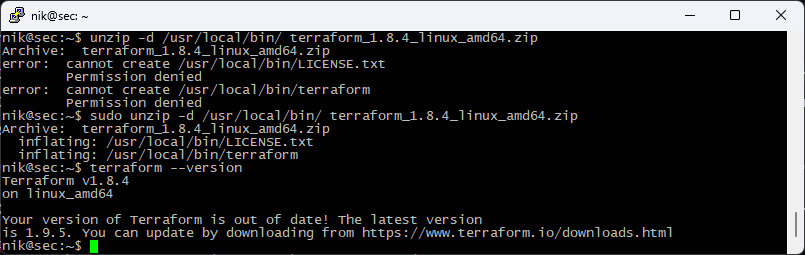
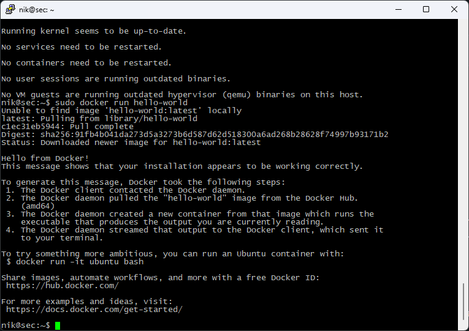

# Домашнее задание к занятию `«Введение в Terraform»` - `Васильев Николай`

------

### Чек-лист готовности к домашнему заданию

1. Скачайте и установите **Terraform** версии ~>1.8.4 . Приложите скриншот вывода команды ```terraform --version```.

2. Скачайте на свой ПК этот git-репозиторий. Исходный код для выполнения задания расположен в директории **01/src**.
3. Убедитесь, что в вашей ОС установлен docker.


------

### Задание 1

1. Перейдите в каталог [**src**](https://github.com/netology-code/ter-homeworks/tree/main/01/src). Скачайте все необходимые зависимости, использованные в проекте. 
2. Изучите файл **.gitignore**. В каком terraform-файле, согласно этому .gitignore, допустимо сохранить личную, секретную информацию?(логины,пароли,ключи,токены итд)

```personal.auto.tfvars```
3. Выполните код проекта. Найдите в state-файле секретное содержимое созданного ресурса **random_password**, пришлите в качестве ответа конкретный ключ и его значение.
```terraform
"result": "bher3CmZaXSwhPMg",
```
4. Раскомментируйте блок кода, примерно расположенный на строчках 29–42 файла **main.tf**.
Выполните команду ```terraform validate```. Объясните, в чём заключаются намеренно допущенные ошибки. Исправьте их.
```commandline
*Пропущено имя ресурса.
│ Error: Missing name for resource
│
│   on main.tf line 24, in resource "docker_image":
│   24: resource "docker_image" {
│
│ All resource blocks must have 2 labels (type, name).
╵

*Неверное имя ресурса.
│ Error: Invalid resource name
│
│   on main.tf line 29, in resource "docker_container" "1nginx":
│   29: resource "docker_container" "1nginx" {
│
│ A name must start with a letter or underscore and may contain only letters, digits,
│ underscores, and dashes.

*У "random_password" нет name="random_string_FAKE"
│ Error: Reference to undeclared resource
│
│   on main.tf line 31, in resource "docker_container" "nginx":
│   31:   name  = "example_${random_password.random_string_FAKE.resulT}"
│
│ A managed resource "random_password" "random_string_FAKE" has not been declared in the root
│ module.

* Неверный регистр
│ Error: Unsupported attribute
│
│   on main.tf line 31, in resource "docker_container" "nginx":
│   31:   name  = "example_${random_password.random_string.resulT}"
│
│ This object has no argument, nested block, or exported attribute named "resulT". Did you mean
│ "result"?

```
5. Выполните код. В качестве ответа приложите: исправленный фрагмент кода и вывод команды ```docker ps```.

```terraform
terraform {
  required_providers {
    docker = {
      source  = "kreuzwerker/docker"
      version = "~> 3.0.1"
    }
  }
  required_version = "~>1.8.4" /*Многострочный комментарий.
 Требуемая версия terraform */
}
provider "docker" {}

#однострочный комментарий

resource "random_password" "random_string" {
  length      = 16
  special     = false
  min_upper   = 1
  min_lower   = 1
  min_numeric = 1
}


resource "docker_image" "nginx" {
  name         = "nginx:latest"
  keep_locally = true
}

resource "docker_container" "nginx" {
  image = docker_image.nginx.image_id
  name  = "example_${random_password.random_string.result}"

  ports {
    internal = 80
    external = 9090
  }
}
```

```commandline
nik@sec:~/terraform/01/src$ docker ps
CONTAINER ID   IMAGE          COMMAND                  CREATED         STATUS         PORTS                  NAMES
08af22895959   9527c0f683c3   "/docker-entrypoint.…"   2 minutes ago   Up 2 minutes   0.0.0.0:9090->80/tcp   example_bher3CmZaXSwhPMg
```
6. Замените имя docker-контейнера в блоке кода на ```hello_world```. Не перепутайте имя контейнера и имя образа. Мы всё ещё продолжаем использовать name = "nginx:latest". Выполните команду ```terraform apply -auto-approve```.
Объясните своими словами, в чём может быть опасность применения ключа  ```-auto-approve```. Догадайтесь или нагуглите зачем может пригодиться данный ключ? В качестве ответа дополнительно приложите вывод команды ```docker ps```.

```text
Данный флаг может быть полезен в тестовых средах, где могут приветствоваться быстрые изменения.
Требуется особая осторожность при использовании данного флага в производственных средах, т.к. он позволяет вносить изменения не спрашивая подтверждения.
```

```commandline
nik@sec:~/terraform/01/src$ docker ps
CONTAINER ID   IMAGE          COMMAND                  CREATED         STATUS         PORTS                  NAMES
b4396acb23af   9527c0f683c3   "/docker-entrypoint.…"   7 seconds ago   Up 7 seconds   0.0.0.0:9090->80/tcp   hello_world
```
8. Уничтожьте созданные ресурсы с помощью **terraform**. Убедитесь, что все ресурсы удалены. Приложите содержимое файла **terraform.tfstate**.
```terraform
{
  "version": 4,
  "terraform_version": "1.8.4",
  "serial": 12,
  "lineage": "2c640bcf-4f3d-da80-b81b-bad58711355a",
  "outputs": {},
  "resources": [],
  "check_results": null
}
```
9. Объясните, почему при этом не был удалён docker-образ **nginx:latest**. Ответ **ОБЯЗАТЕЛЬНО НАЙДИТЕ В ПРЕДОСТАВЛЕННОМ КОДЕ**, а затем **ОБЯЗАТЕЛЬНО ПОДКРЕПИТЕ** строчкой из документации [**terraform провайдера docker**](https://docs.comcloud.xyz/providers/kreuzwerker/docker/latest/docs).  (ищите в классификаторе resource docker_image )

```terraform
  keep_locally = true
```

```text
keep_locally (Boolean) If true, then the Docker image won't be deleted on destroy operation. If this is false, it will delete the image from the docker local storage on destroy operation.
```