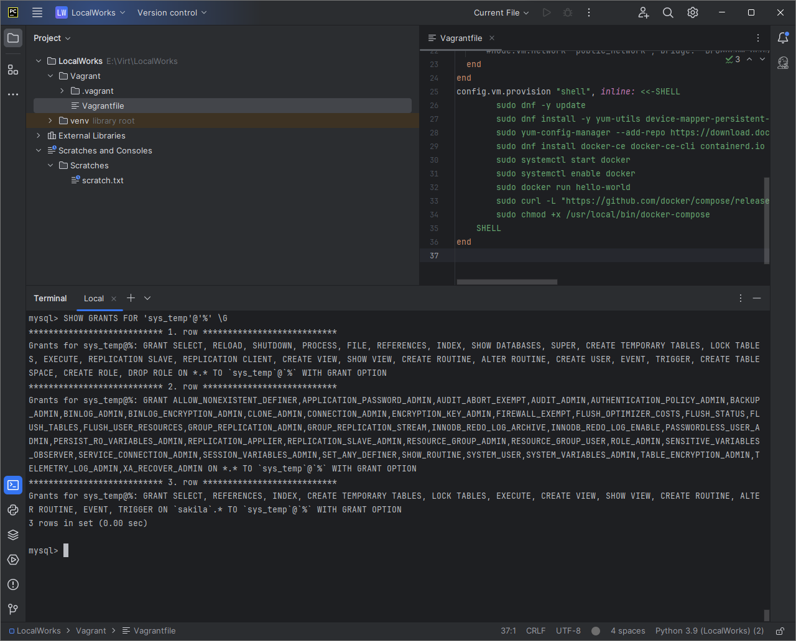

# Домашнее задание к занятию `«12.2 «Работа с данными (DDL/DML)»` - `Васильев Николай`

---
## Задание 1.

[Команды](../img/comands.txt)


---
## Задание 2.

````
Имя таблицы	|Имя первичного ключа в таблице
----------------+------------------------------
actor		|actor_id
address		|address_id
category	|category_id
city		|city_id
country		|country_id
customer	|customer_id
film		|film_id
film_actor	|actor_id,film_id
film_category	|film_id,category_id
film_text	|film_id
inventory	|inventory_id
language	|language_id
payment		|payment_id
rental		|rental_id
staff		|staff_id
store		|store_id
````

---

## Задание 3.

REVOKE INSERT, UPDATE, DELETE, CREATE, DROP, ALTER ON sakila.* FROM 'sys_temp'@'%';

