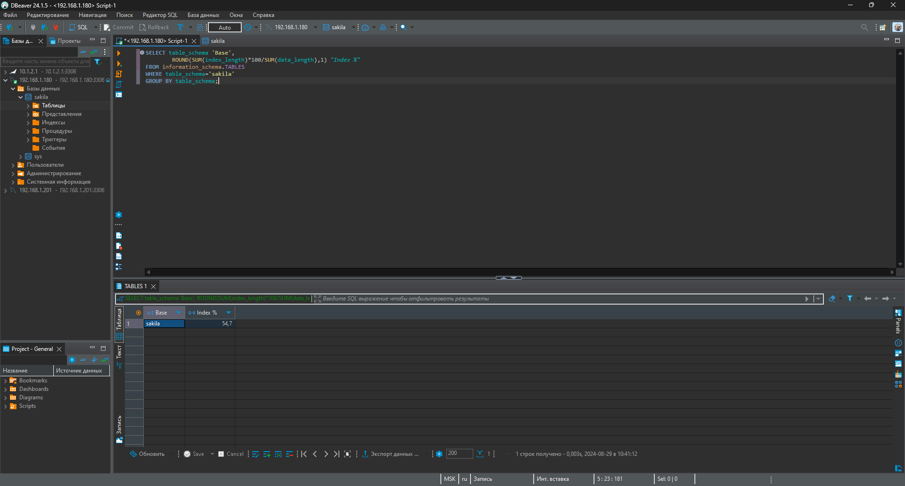
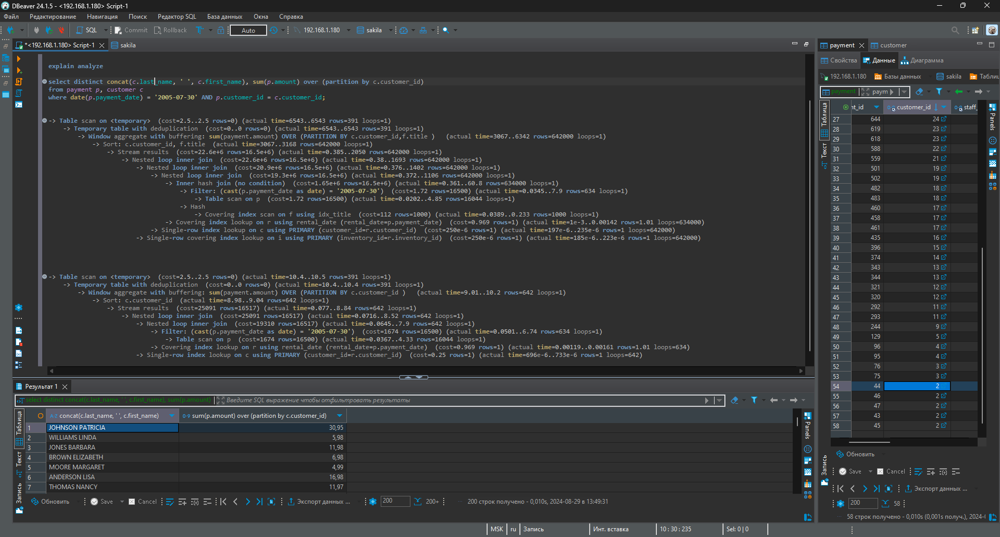

# Домашнее задание к занятию `«Индексы»` - `Васильев Николай`

---
## Задание 1.



---
## Задание 2.



Я думаю, что больше всего времени занимала оконная функция, а именно film.title в ней. Возможно потому-что таблица film находится через 2 связанные таблицы от count.

Еще я заметил что в запросе указывается много лишних таблиц, если задача запроса в том, чтобы получить общую сумму платежей, определенных покупателей в конкретную дату, то думаю что таблицы rental, inventory и film в данном запросе лишние.

### В итоге:
```
select distinct concat(c.last_name, ' ', c.first_name), sum(p.amount) over (partition by c.customer_id)
from payment p, customer c
where date(p.payment_date) = '2005-07-30' AND p.customer_id = c.customer_id;
```
