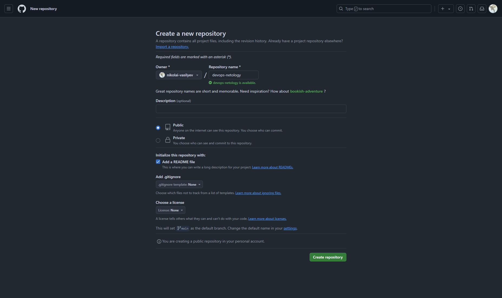
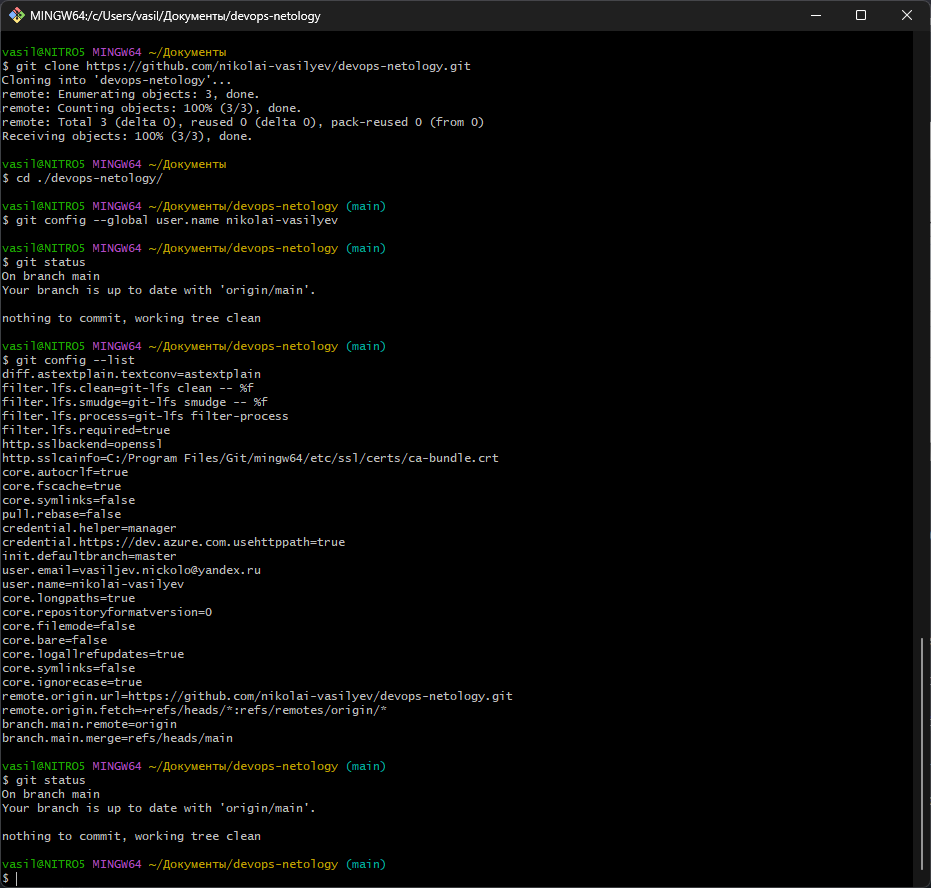
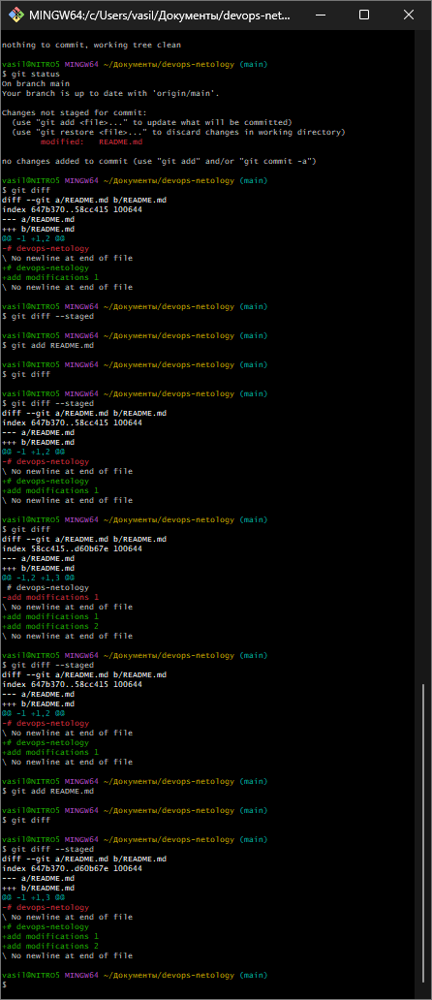
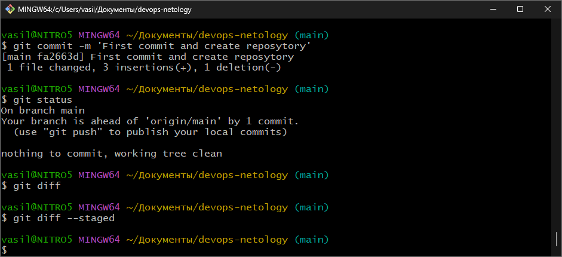
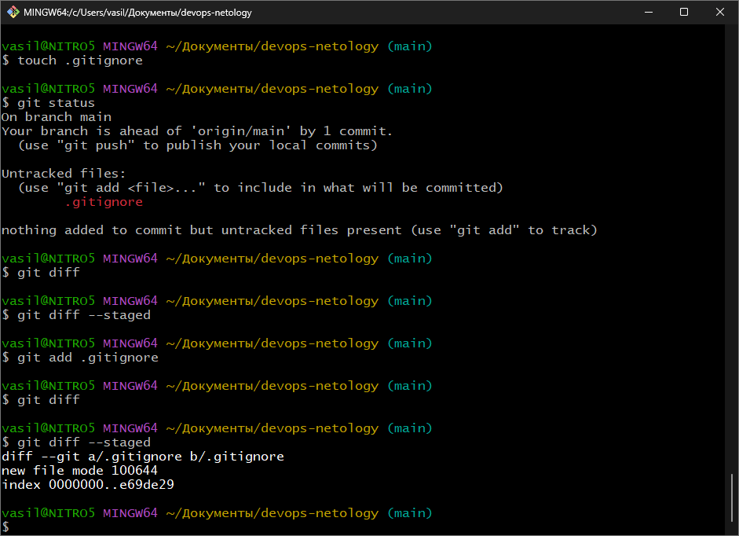
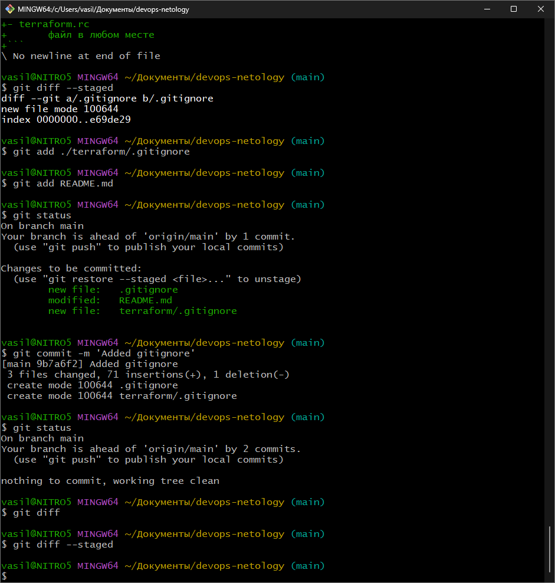
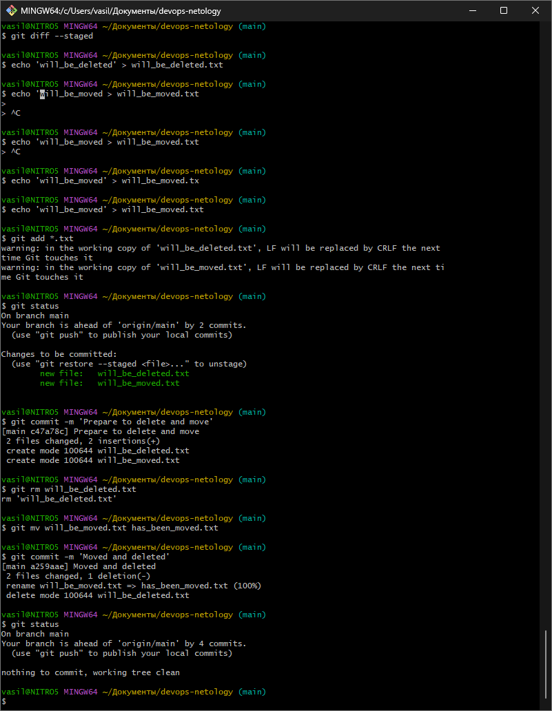
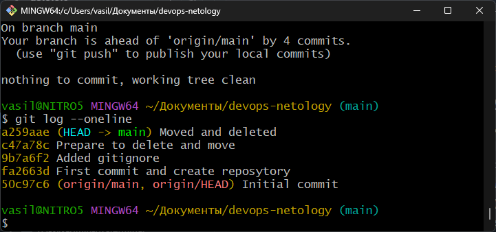
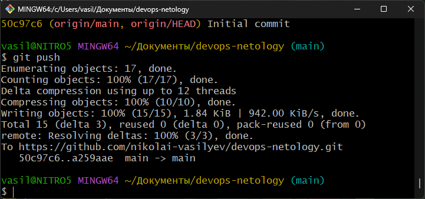

# Домашнее задание к занятию `«Системы контроля версий»` - `Васильев Николай`

---
## Задание 1. Создать и настроить репозиторий для дальнейшей работы на курсе
[Репозиторий devops-netology](https://github.com/nikolai-vasilyev/devops-netology)

### Создание репозитория и первого коммита

### Создание файлов .gitignore и второго коммита

### Эксперимент с удалением и перемещением файлов (третий и четвёртый коммит)

### Проверка изменения

### Отправка изменений в репозиторий
