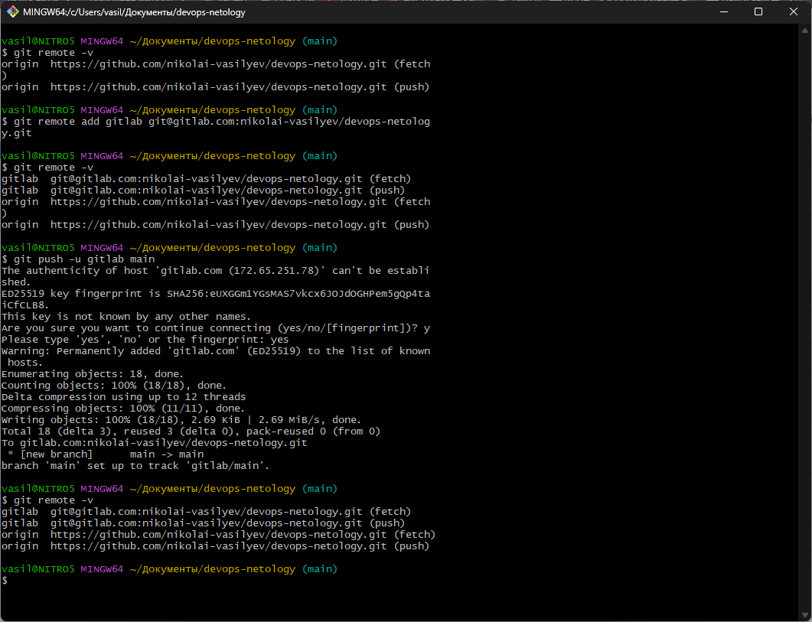
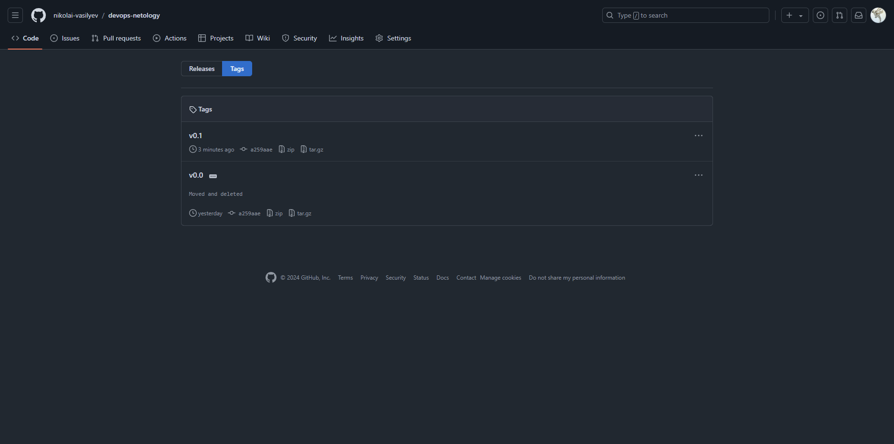
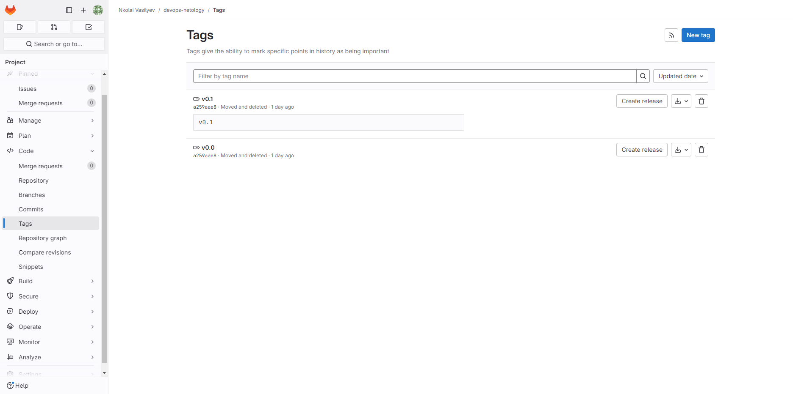
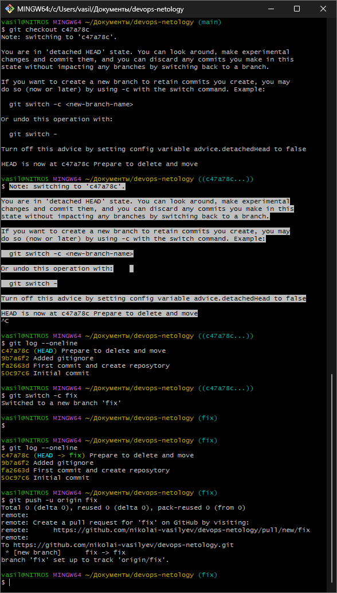
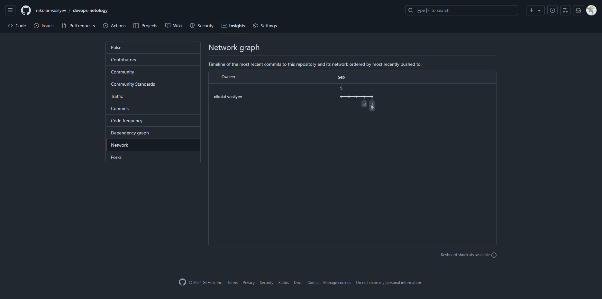
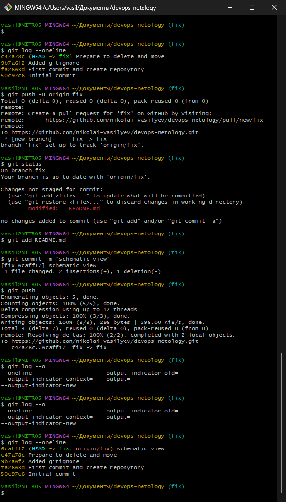
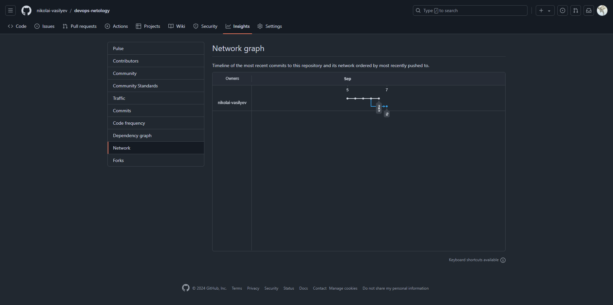
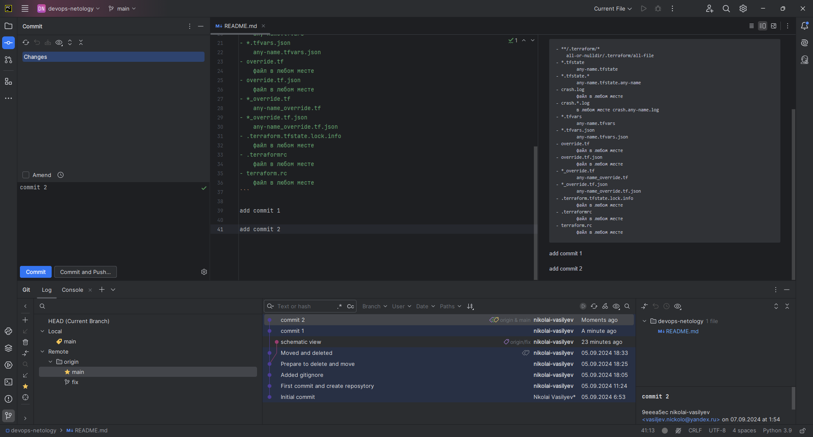

# Домашнее задание к занятию `«Основы Git»` - `Васильев Николай`

---
## Задание 1. Знакомимся с GitLab и Bitbucket

---
## Задание 2. Теги

---
## Задание 3. Ветки

---
## Задание 4. Упрощаем себе жизнь

[Репозиторий github](https://github.com/nikolai-vasilyev/devops-netology)

[Репозиторий gitlab](https://gitlab.com/nikolai-vasilyev/devops-netology)