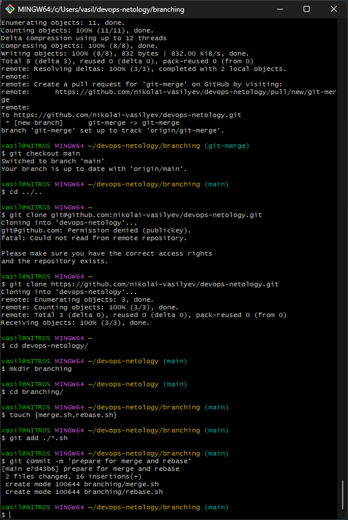
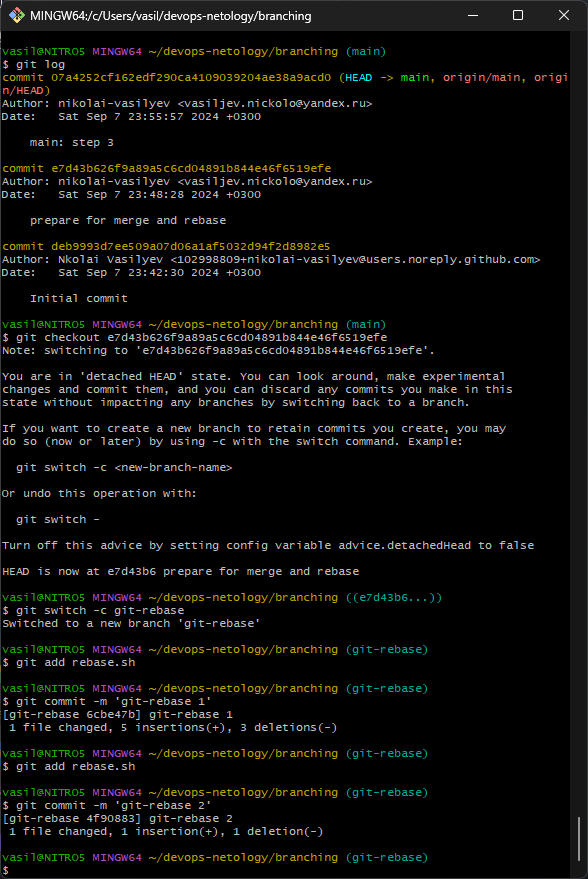
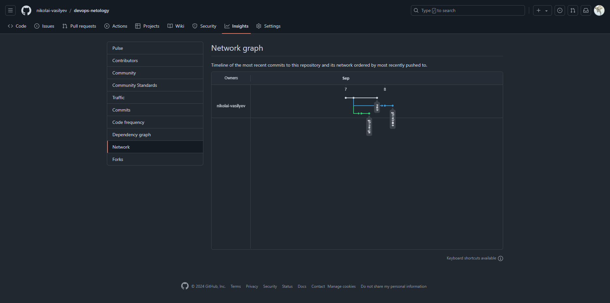
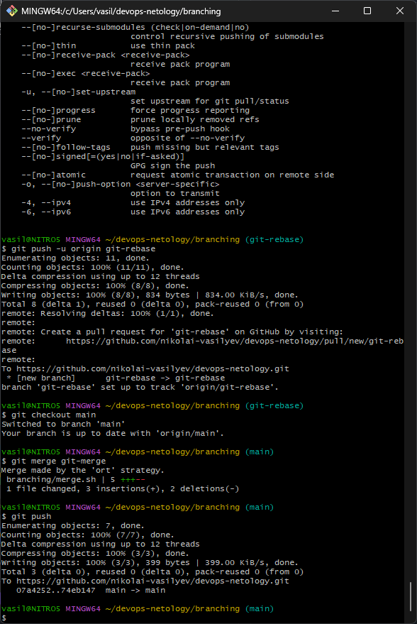
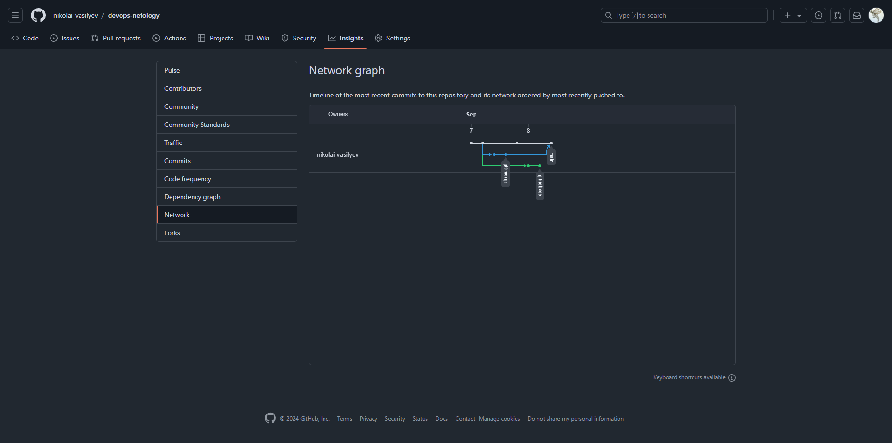
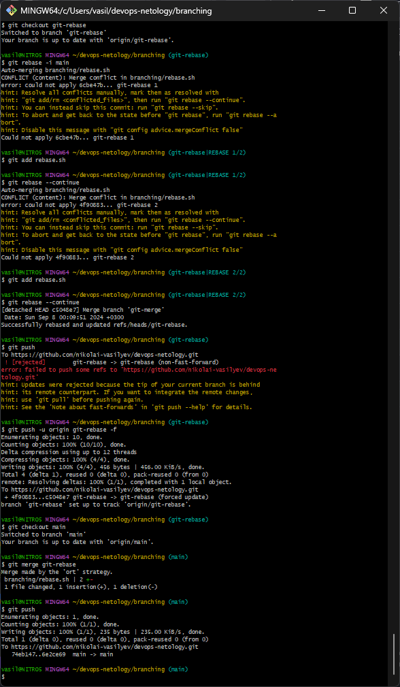

# Домашнее задание к занятию `«Ветвления в Git»` - `Васильев Николай`

---
## Задание «Ветвление, merge и rebase»

### Подготовка файла merge.sh_Изменим main

### Подготовка файла rebase.sh

### Промежуточный итог

### Merge

### Rebase

[Репозиторий githab](https://github.com/nikolai-vasilyev/devops-netology)